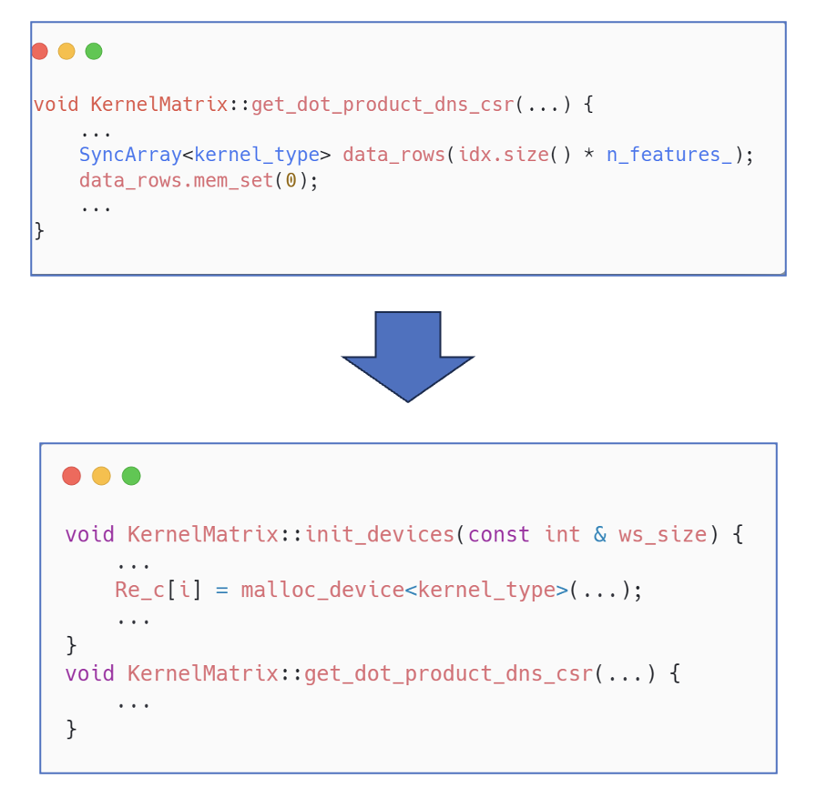

# ThunderSVM在Intel GPU上的移植与优化

## 1 背景介绍

支持向量机（SVM）是机器学习中经典的监督学习模型，SVM对于大型和复杂问题的计算量是非常巨大的。ThunderSVM是一款高性能SVM库，包含了分类（SVC），回归（SVR），单类SVM等模型。然而该库并不支持Intel GPU，因此本项目将ThunderSVM的SVC模型的训练过程移植到了Intel GPU上并针对Intel GPU平台对其进行了优化。

我们通过OneAPI中vtune，OneAPI-GDB，OneMKL等工具，对该代码进行了性能分析与多种优化，最终将ThunderSVM中SVC模型的训练加速了34倍（相比于原CPU代码）。

## 2 软硬件环境

## 3 优化方法

#### 3.1 代码结构

Thundersvm 的训练部分架构大致如下图所示，本项目优化的模型为Thundersvm中的C_SVC，其处理的问题为二分类问题。SVC训练过程会多用化多个kernel，其中占据整体运行时间90%以上的kernel为kernelMartix_kernel中的csr_dns_mul，该部分原代码中是调用了Eigen中的稀疏矩阵乘法。因此整体SVC模型训练的性能瓶颈在于该稀疏矩阵乘法算子，后续的优化也围绕着该kernel上。

#### 3.2 移植Intel GPU

我们首先使用OneAPI支持的Sycl语言将原来的CPU代码移植到了Intel GPU上，并且将绝大部分kernel进行了移植，此外我们使用OneMKL的提供的算子对部分kernel进行了优化。

其中稀疏矩阵乘法kernel的移植前后代码如下图所示。

移植到Intel GPU上后，相比于原代码加速比达到了10.7。

#### 3.3 多GPU并行

使用Vtune对移植后的代码profile后，我们发现耗时最长的kernel为稀疏矩阵乘法，占时比95%以上。OneMKL提供的稀疏矩阵乘接口是无法部署到多GPU上的，因此我们对数据进行了划分，并通过多张GPU并行来加速稀疏矩阵乘。

硬件的分配如下图所示，2块Intel GPU共有四个Tile，其中：

- CPU负责计算任务的提交与多卡运算时的数据分配。
- Tile 0负责存储绝大部分的数据，同时执行计算。
- Tile1~3负责在计算GEMM时进行协同计算，提高计算速度。

数据划分如下图所示，将dns_data（稀疏矩阵乘法对应的矩阵A）沿着M维度切分成4份并分配给对应的GPU Tile。具体数据划分的细节如下：

- k_mat：由于k_mat在整个计算过程中不会发生变化，我们将k_mat在计算开始前复制到到四个 Tile 上，以减少反复拷贝。
- dns_data：将 dns_data 均匀分为四份，分别交给四个Tile 计算以获得加速性能。
- 其他数据：直接存放于Tile 0中。

使用4个Intel GPU Tile加速后，整体的SVC训练速度提高了2.7倍。

#### 3.4 内存预分配，AoT编译

在计算矩阵乘法时，程序每次都会重新申请内存，效率较低。通过将内存进行了预分配，减少了内存的反复申请。我们在编译时也加入了AoT编译，减少即时编译的时间。 该优化提高了约7%的性能。部分代码如下所示：

#### 3.5 减少handle创建次数

MKL矩阵乘法计算时，会涉及到handle的反复创建，但由于k_mat不会变化，只需在全局创建一次即可。该优化的加速比为1.15。

## 4 总结

综上所示，我们通过oneAPI将ThunderSVM中的C_SVC模型的训练从CPU移植到了GPU上，并通过多种优化方法最终使训练加速了34倍。